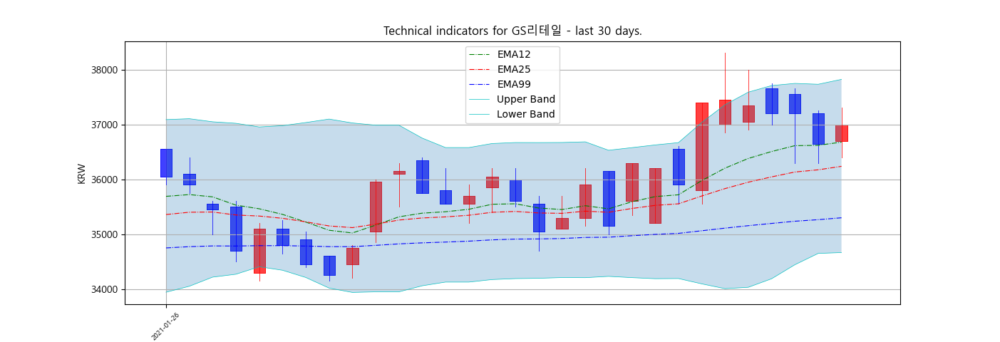

# Stock_Prediction_Toy_Project
>### Plot chart
<p align="center">
  
</p>

>### Setup
```
+ python 3.7
pip install tensorflow == 1.14
pip install finta 
pip install matplotlib
pip install pandas 
pip install pykrx 
pip install mpl-finance
pip install seaborn 
pip install GPUtil 
pip install scikit-learn 
pip install tqdm

```

>### To do list
```
1. Krx daily chart update (Clear)
2. Reading train set (Clear)
3. Showing chart (Clear)
4. Feature extraction
5. Technical Indicator save in csv (Clear)
6. Beat or lose
7. EPS/DIV ... save in csv
8. Searching 52 weeks high - highest price (Clear)
```
