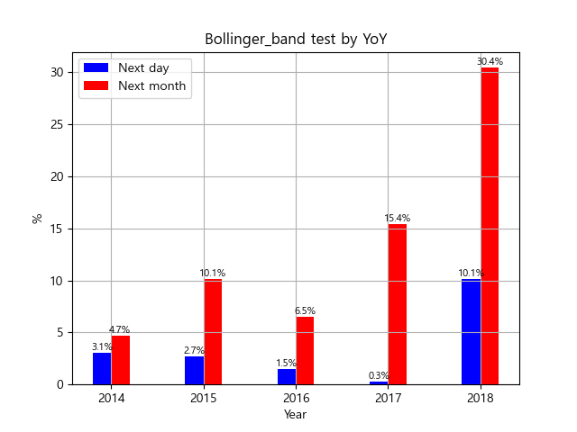

# Stock_Prediction_Toy_Project
>### Backtesting (RSI & EMA CrossOver)
<p align="center">
  
</p>

>### Plot chart
<p align="center">
  
</p>

>### RSI test by YoY
<p align="center">
  
</p>

>### Bollinger band test by YoY
<p align="center">
  
</p>

>### Ultimate oscillator test by YoY
<p align="center">
  
</p>

>### To do list
```
1. LSTM Vanila model change (TF - Pytorch)
2. statistical analysis (base year top-10)
3. Feature extraction
4. Survey deep learning for stock prediction
5. Collecting datasets
```

>### Setup
```
+ python 3.8
pip install backtrader requests tabulate
pip install finta 
pip install matplotlib
pip install pandas 
pip install pykrx 
pip install mplfinance
pip install seaborn 
pip install GPUtil 
pip install scikit-learn 
pip install tqdm
pip install trendln
pip install yfinance
(Optional) pip install tensorflow==2.2.0
```
